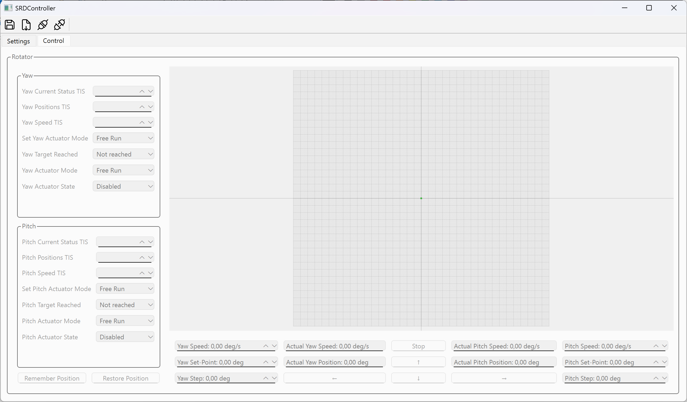

# SDRController

Приложение для управления опорно-поворотным устройством (ОПУ) на основе протокола CANaerospace.

В роли приемопередатчика CAN выступает Arduino Uno с платой расширения [CAN-BUS Shield](https://wiki.seeedstudio.com/CAN-BUS_Shield_V1.2/ "CAN-BUS Shield") на основе чипа MCP2515. Взаимодействие ПК с Arduino осуществляется по COM-порту.

## Зависимости

Для скетча Arduino требуется библиотека [arduino-mcp2515](https://github.com/autowp/arduino-mcp2515 "arduino-mcp2515") с [данным фиксом](https://github.com/autowp/arduino-mcp2515/issues/107 "данным фиксом").

Для десктопного приложения требуется модуль [QUAsyncSerialPort](https://github.com/netlcod/QUDevice/tree/main/devices/quasyncserialport "QUAsyncSerialPort") из библиотеки [QUDevice](https://github.com/netlcod/QUDevice "QUDevice"). Сборка осуществлялась с использованием Qt 6.8.1.

